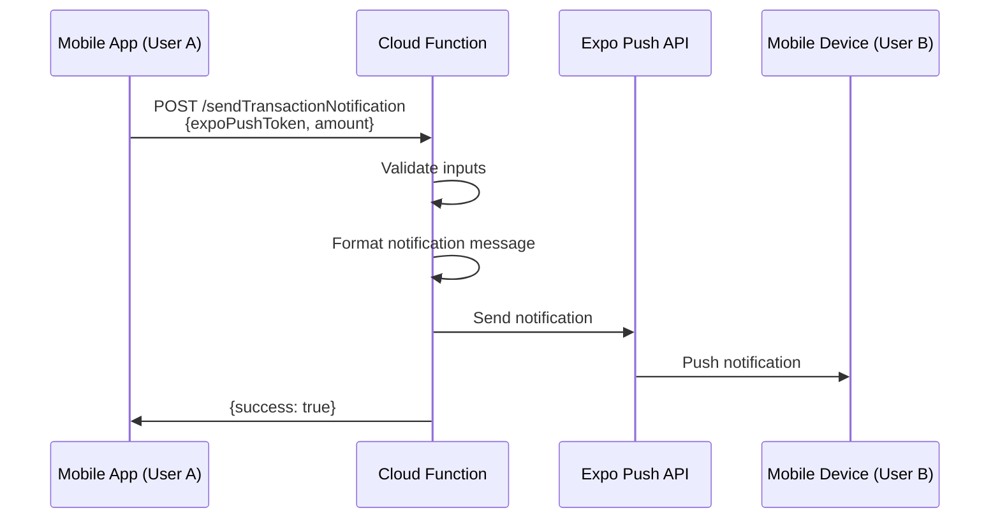

# Design Document: Expo Push Notifications Handler

## Overview

This design describes a minimal Firebase Cloud Functions service for sending instant push notifications when Lightning wallet transactions occur. The system consists of a single Cloud Function that accepts transaction details and sends a formatted notification via the Expo Push API to the recipient's mobile device.

The architecture is intentionally simple: a single serverless function that validates input, formats a notification message, and sends it through the Expo Push API. No database, no scheduling, no complex services - just instant notification delivery.

## Architecture



**Flow:**
1. User A's mobile app completes a Lightning payment to User B
2. User A's app calls the Cloud Function with User B's device token and payment amount
3. Cloud Function validates the request parameters
4. Cloud Function formats the notification: "You received X sats!"
5. Cloud Function sends the notification via Expo Push API
6. Expo delivers the push notification to User B's device
7. Cloud Function returns success/error response

**Key Design Decisions:**
- **Single Cloud Function**: One HTTP-triggered function handles all notification sending
- **No Database**: Device tokens are provided by the caller (mobile app manages them)
- **Synchronous**: Function waits for Expo Push API response before returning
- **Minimal Dependencies**: firebase-functions, dotenv, zod (Node 20 built-in fetch)
- **TypeScript**: Type safety for request/response contracts

## Components and Interfaces

### Project Structure

```
notifications/
├── src/
│   ├── index.ts                 # Cloud Function entry point
│   ├── config.ts                # Env config (dotenv + zod)
│   ├── types.ts                 # TypeScript interfaces
│   └── validation.ts            # Input validation logic
├── tests/
│   └── index.test.ts            # Unit tests with vitest
├── package.json
├── tsconfig.json
└── firebase.json
```

### Core Interfaces

```typescript
// Request interface
interface TransactionNotificationRequest {
  expoPushToken: string;  // Expo push token
  amount: number;       // Amount in sats (positive integer)
}

// Response interface
interface TransactionNotificationResponse {
  success: boolean;
  message?: string;
  error?: string;
}

// Expo Push API message structure
interface ExpoPushMessage {
  to: string;
  title: string;
  body: string;
  data?: Record<string, string | number | boolean>;
}
```

### Cloud Function: sendTransactionNotification

**Purpose:** HTTP-triggered Cloud Function that sends transaction notifications via Expo Push API.

**Signature:**
```typescript
export const sendTransactionNotification = onRequest(
  async (request: Request, response: Response) => {
    // Implementation
  }
);
```

**Logic:**
1. Parse request body to extract `expoPushToken` and `amount`
2. Validate inputs using validation module
3. If validation fails, return 400 error with descriptive message
4. Format Expo push message with title and body
5. POST to Expo Push API with formatted message
6. If Expo succeeds, return 200 with success response
7. If Expo fails, log error and return 500 with error response
8. Catch any unexpected errors, log them, and return 500

**Error Handling:**
- Missing/invalid parameters -> 400 Bad Request
- Expo Push API errors -> 500 Internal Server Error
- Unexpected errors → 500 Internal Server Error

### Validation Module

**Purpose:** Validate request parameters before sending notifications.

**Function:**
```typescript
function validateRequest(
  expoPushToken: unknown,
  amount: unknown
): { valid: boolean; error?: string }
```

**Validation Rules:**
- `expoPushToken` must be a non-empty string
- `amount` must be a positive number (> 0)
- Both parameters must be present

**Returns:**
- `{ valid: true }` if all checks pass
- `{ valid: false, error: "description" }` if validation fails

### Expo Push API Client

**Purpose:** Send a push message to Expo's HTTP API from the Cloud Function.

**Implementation:**
```typescript
const response = await fetch('https://exp.host/--/api/v2/push/send', {
  method: 'POST',
  headers: { 'Content-Type': 'application/json' },
  body: JSON.stringify(message),
});
```

**Configuration:**
- Load `.env` via `dotenv/config` for local development
- Validate configuration with `zod` on startup
- Use `EXPO_PUSH_API_URL` if set, otherwise default to `https://exp.host/--/api/v2/push/send`
- Uses Node 20 built-in fetch
- For local testing, mock fetch

### Configuration Module

**Purpose:** Provide a simple, validated configuration surface for new developers.

**Implementation:**
```typescript
import 'dotenv/config';
import { z } from 'zod';

const configSchema = z.object({
  EXPO_PUSH_API_URL: z.string().url().default('https://exp.host/--/api/v2/push/send'),
});

export const config = configSchema.parse(process.env);
```

**.env Example:**
```
EXPO_PUSH_API_URL=https://exp.host/--/api/v2/push/send
```

## Data Models

### Request Payload

```json
{
  "expoPushToken": "ExponentPushToken[xxxxxxxxxxxxxxxxxxxxxx]",
  "amount": 1000
}
```

**Fields:**
- `expoPushToken` (string): Expo push token obtained from the mobile device
- `amount` (number): Payment amount in satoshis (positive integer)

### Success Response

```json
{
  "success": true,
  "message": "Notification sent successfully"
}
```

### Error Response

```json
{
  "success": false,
  "error": "Invalid amount: must be a positive number"
}
```

**HTTP Status Codes:**
- `200`: Notification sent successfully
- `400`: Invalid request parameters
- `500`: Server error (Expo Push API failure or unexpected error)

### Expo Push API Message Format

The notification sent to the Expo Push API follows this structure:

```typescript
{
  to: expoPushToken,
  title: "Payment Received",
  body: "You received 1000 sats!"
}
```

**Expo Compatibility:**
- Uses Expo Push API message format
- Compatible with expo-notifications ~0.29.14
- Will display as a system notification on both iOS and Android


## Error Handling

### Input Validation Errors (400)

**Trigger:** Invalid request parameters
**Response:**
```json
{
  "success": false,
  "error": "Missing or invalid expoPushToken"
}
```

**Validation Checks:**
- expoPushToken must be present and non-empty string
- amount must be present and positive number

### Expo Push API Errors (500)

**Trigger:** Firebase Cloud Messaging API returns an error
**Handling:**
1. Log the full error object with `console.error()`
2. Return 500 status with error message
3. Include sanitized error description in response

**Example Errors:**
- Invalid device token (token expired or malformed)
- Expo Push API service unavailable
- Authentication failure

**Response:**
```json
{
  "success": false,
  "error": "Failed to send notification: <error details>"
}
```

### Unexpected Errors (500)

**Trigger:** Any uncaught exception in the function
**Handling:**
1. Catch in top-level try-catch block
2. Log the error with `console.error()`
3. Return generic 500 error response

**Response:**
```json
{
  "success": false,
  "error": "An unexpected error occurred"
}
```

## Testing Strategy

### Unit Testing Approach

This project uses unit tests to ensure coverage of expected behavior, edge cases, and error conditions.

### Testing Framework

**Framework:** Vitest
**Reason:** Fast, TypeScript-native, modern testing framework with excellent mocking support

### Unit Tests

Unit tests focus on:
- **Specific examples**: Valid notification request with known values
- **Edge cases**: Empty strings, zero amounts, negative amounts
- **Error conditions**: Missing parameters, Expo Push API failures
- **Integration points**: Firebase Admin SDK initialization

**Example Unit Tests:**
```typescript
describe('sendTransactionNotification', () => {
  it('should send notification with valid inputs', async () => {
    // Test with specific expoPushToken and amount
  });
  
  it('should reject empty expoPushToken', async () => {
    // Test with empty string
  });
  
  it('should reject zero amount', async () => {
    // Test with amount = 0
  });
  
  it('should handle Expo Push API errors gracefully', async () => {
    // Mock fetch to return error
  });
});
```

### Property-Based Tests

Property tests verify universal properties using randomized inputs:

### Test Mocking Strategy

**Firebase Admin SDK:**
- Mock fetch to avoid actual Expo Push API calls
- Return success or throw errors based on test scenario
- Verify correct message structure is passed to send()

**Example Mock:**
```typescript
global.fetch = vi.fn().mockResolvedValue({
  ok: true,
  json: async () => ({ data: [{ status: 'ok' }] }),
});
```

### Test Coverage Goals

All validation paths, error handling paths, and success paths must be covered.
